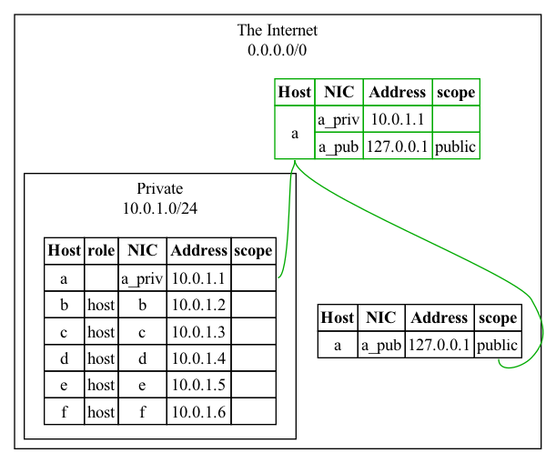
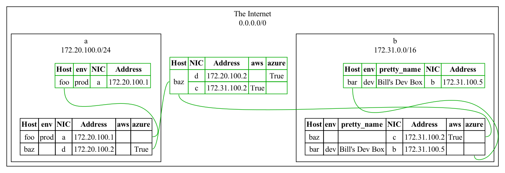

# ndia

_A tool for making network diagrams_

This is a Python tool that builds a network graph from a description, then
emits a (large) file to be ingested by GraphViz' `dot` tool. It understands
that a `host` may have multiple `nic`s, and does the work of sorting those
`nic`s into appropriate `net`s as you declare them. If you have an automation
tool that can tell you your `net`s, `host`s, and `nic`s, this should be able to
plot it with relative ease.

```python
from ndia import Diagram, GraphViz, Styler
from ipaddress import ip_address, ip_network
import sys

dia = Diagram()

# Hosts are scoped with context managers; they take only a name
with dia.host('a') as h:

    # NICs take an address and a name
    dia.nic(ip_address('10.0.1.1'), 'a_priv')

    # The returned NIC object has an `info` dict that can be given arbitrary properties
    # These properties will show up in the tables generated
    nic = dia.nic(ip_address('127.0.0.1'), 'a_pub')
    nic.info['scope'] = 'public'

# Filling out a more typical large LAN:
hosts = {name: ip_address(f'10.0.1.{octet}') for name, octet in zip('bcdef', range(2, 100))}

for hname, addr in hosts.items():
    with dia.host(hname) as h:
        dia.nic(addr, hname)

        # Hosts also have an `info` property that works similarly
        h.info['role'] = 'host'

# You can declare your network structure simultaneously, before, or afterward
# Nets, too, have an `info` property, but it doesn't render by default
# Instead, Stylers can use it to change styles
net = dia.net_sub(ip_network('10.0.1.0/24'), 'Private')
net.info['scope'] = 'private'

# Actually draw the current state
# We're using the default Styler, but you can derive your own to set fairly
# arbitrary attributes on the GraphViz statements
dia.render(GraphViz(sys.stdout), Styler())
```

The resulting diagram looks like this, once rendered with `dot`:



You can, of course, go nuts with properties, topologies, and so forth, and
hopefully GraphViz can keep up.

If you want to get started right away, there's a tool `ndia_flatfile.py` which
implemends a `cmd.Cmd` language that looks a little like the following:

```
opt all_hosts
net a 172.20.100.0/24
net b 172.31.0.0/16
host foo env=prod
nic a 172.20.100.1
host bar env=dev "pretty_name=Bill's Dev Box"
nic b 172.31.100.5
host baz
nic c 172.31.100.2 aws
nic d 172.20.100.2 azure
#show host foo
#show host bar
#show net
#show root
```



On quit, it writes the resulting diagram to stdout. You might not want to
target this language, as it's strictly less powerful than Python and subject to
change, but it comes in handy to pass around descriptions.
